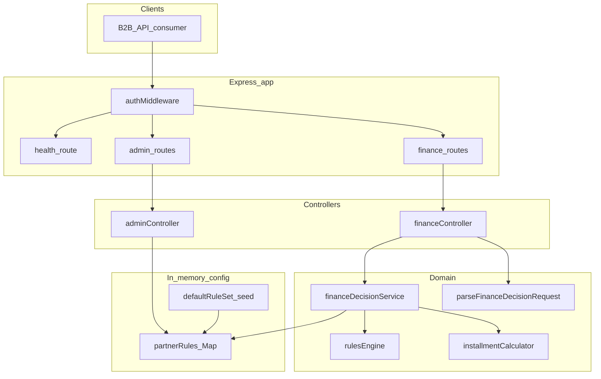

# Architecture

- **HTTP**: `authMiddleware` is a no-op placeholder for this POC.
- **Finance flow**: Validate JSON → load partner rule set → evaluate DENY rules → if financeable, compute installments (defaults: request overrides, then partner `defaults`, then 12 months + `MONTHLY`).
- **Admin flow**: CRUD partner rule sets into the in-memory map only (no database).
